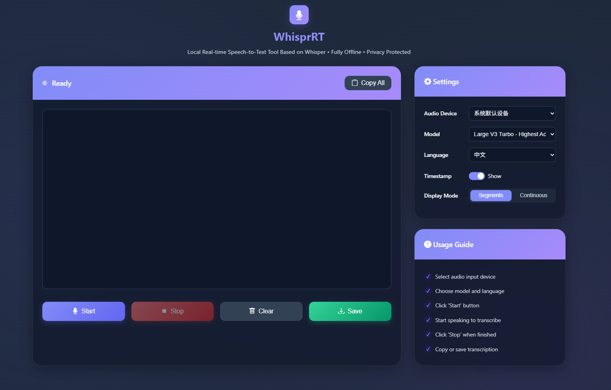
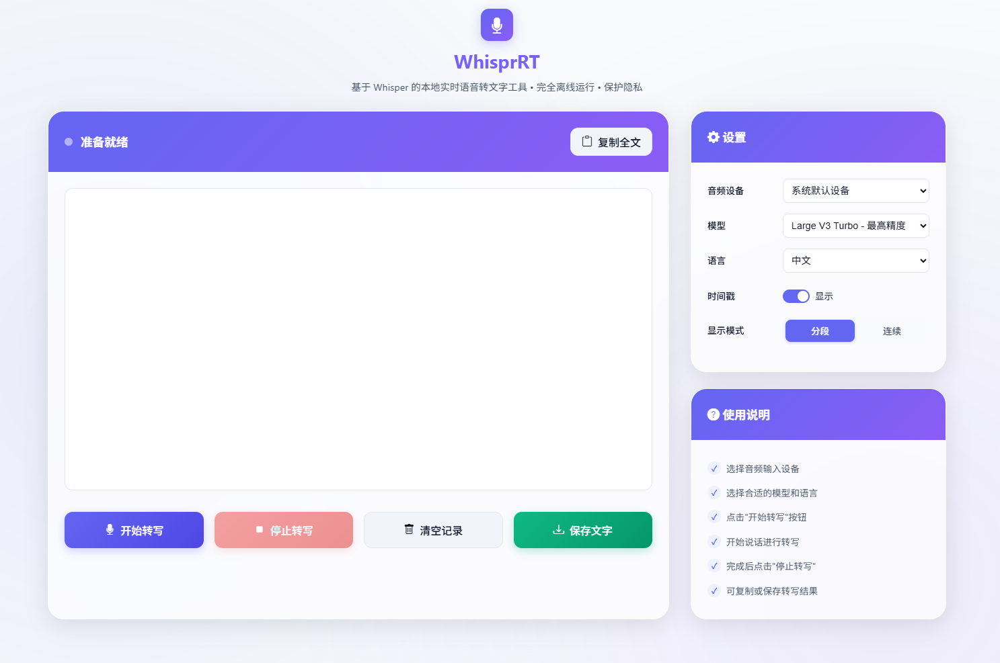

# WhisprRT - Real-time Speech-to-Text Transcription

<p align="center">
  <a href="https://github.com/zhengjim/WhisprRT"></a>
  <a href="https://fastapi.tiangolo.com"></a>
  <a href="https://github.com/zhengjim/WhisprRT"></a>
  <a href="https://github.com/zhengjim/WhisprRT/blob/main/LICENSE"></a>
</p>

**WhisprRT** is a local real-time speech-to-text transcription tool based on [OpenAI Whisper](https://github.com/openai/whisper), supporting completely offline operation. Powered by FastAPI with a lightweight web interface, it's fast, stable, privacy-focused, and suitable for meeting transcription, note-taking, personal assistants, and more.

🌏 **Languages:** [English](#english) | [中文](#中文)

---

## English

### ✨ Key Features

- 🚀 **Real-time Transcription**: Low latency, fast conversion from speech to text
- 🔒 **100% Offline**: No internet required, data never uploaded, privacy guaranteed
- 🌐 **Modern Web Interface**: Clean, responsive UI with dark mode support
- 🌍 **Multi-language UI**: Switch between English and Chinese interfaces
- 🎨 **Modern Design**: Glassmorphism effects, smooth animations, and intuitive controls
- 🛡️ **Anti-hallucination Optimization**: Filters and reduces hallucination content from the large-v3-turbo model

### 📸 Screenshots

**Main Interface - Light Mode**



**Main Interface - Dark Mode**



### 🎯 Use Cases

- **Meeting Transcription**: Real-time recording of meeting content for efficient organization
- **Personal Notes**: Convert voice ideas to text instantly
- **Learning Aid**: Transcribe lectures or courses for easy review
- **Content Creation**: Quickly convert spoken content to text drafts

### 🚀 Quick Start

#### Prerequisites

- **Python**: 3.10 or higher
- **Operating System**: Windows, MacOS, or Linux
- **Internet Connection**: Only needed for initial model download

#### Installation (Windows)

1. **Clone the Repository**
   ```bash
   git clone https://github.com/zhengjim/WhisprRT.git
   cd WhisprRT
   ```

2. **Run the Installation Script**
   ```bash
   install.bat
   ```

   The installation script will:
   - Create a Python virtual environment
   - Install all required dependencies
   - Download the Whisper model (may take some time on first run)

3. **Start the Server**
   ```bash
   start.bat
   ```

4. **Access the Application**

   Open your browser and navigate to:
   ```
   http://127.0.0.1:8000
   ```

> **Note**: It's recommended to run only on `127.0.0.1` to prevent unauthorized access.

#### Manual Installation

If the scripts don't work, you can install manually:

```bash
# Create virtual environment
python -m venv .venv

# Activate virtual environment
# On Windows:
.venv\Scripts\activate
# On Linux/MacOS:
source .venv/bin/activate

# Install dependencies
pip install fastapi>=0.115.12 faster-whisper>=1.1.1 jinja2>=3.1.6 numpy>=2.2.5 sounddevice>=0.5.1 uvicorn[standard]>=0.34.2 websockets>=15.0.1

# Start the server
uvicorn app.main:app --host 0.0.0.0 --port 8000 --reload
```

### 🎙️ Recording System Audio

- **MacOS**: Use [BlackHole](https://github.com/ExistentialAudio/BlackHole) to record system audio
- **Windows**: Use [VB-CABLE](https://vb-audio.com/Cable/) to record system audio

For detailed tutorials, refer to the [Buzz Documentation](https://chidiwilliams.github.io/buzz/docs/usage/live_recording).

### 🤖 Model Selection

WhisprRT defaults to the `large-v3-turbo` model, recommended for best results. You can switch models in the settings:

| Model             | Performance | Speed    | Accuracy |
|-------------------|-------------|----------|----------|
| large-v3-turbo    | Medium      | Fast     | High     |
| medium            | Low         | Medium   | Medium   |
| small             | Very Low    | Slow     | Low      |
| tiny              | Minimal     | Fastest  | Lowest   |

> **Tip**: Real-time transcription is performance-sensitive. Choose a model appropriate for your hardware.

### 🛡️ Anti-hallucination Features

To address hallucination issues common with the `large-v3-turbo` model (such as repeated advertising text), WhisprRT includes multi-layer filtering:

#### Core Optimizations

1. **Parameter Tuning**
   - Temperature lowered to 0.0 to reduce randomness
   - `no_speech_threshold` increased to 0.6 for enhanced silence detection
   - `condition_on_prev_tokens` disabled to avoid circular dependencies

2. **Smart Filtering**
   - Built-in 15+ hallucination content detection patterns
   - Automatic recognition of repeated text patterns
   - Confidence threshold filtering for low-quality results

3. **Audio Preprocessing**
   - Enhanced silence detection (energy + zero-crossing rate + spectral analysis)
   - High-pass filter to remove low-frequency noise
   - Normalization processing for improved recognition accuracy

#### Configuration API

You can dynamically adjust anti-hallucination parameters through the API:

```bash
# Get current configuration
curl http://127.0.0.1:8000/anti_hallucination_config

# Update parameters
curl -X POST http://127.0.0.1:8000/update_anti_hallucination_config \
  -H "Content-Type: application/json" \
  -d '{"confidence_threshold": 0.7, "silence_threshold": 0.003}'

# Reset to defaults
curl -X POST http://127.0.0.1:8000/reset_anti_hallucination_config
```

### 🎨 UI Features

- **Theme Switching**: Toggle between light and dark modes
- **Language Switching**: Switch between English and Chinese interfaces
- **Display Modes**: Choose between segmented or continuous transcription display
- **Timestamp Control**: Show or hide timestamps for each transcription segment
- **Audio Device Selection**: Choose from available audio input devices
- **Model Selection**: Switch between different Whisper models
- **Export Options**: Copy to clipboard or save as text file

### ⚙️ Configuration

Edit `app/config.py` to customize:

- Audio settings (sample rate, buffer size)
- Model preferences
- Anti-hallucination thresholds
- Server host and port

### 📝 API Documentation

Once the server is running, access the interactive API documentation:

- **Swagger UI**: http://127.0.0.1:8000/api/docs
- **ReDoc**: http://127.0.0.1:8000/api/redoc

### 🔌 External API Integration

WhisprRT provides both REST API and WebSocket interfaces for external applications to access real-time transcription results.

#### Quick Start

**REST API** - Query transcription data:
```bash
# Get API information
curl http://localhost:8000/api/info

# Get all transcripts
curl http://localhost:8000/api/transcripts

# Get latest transcript
curl http://localhost:8000/api/latest

# Get transcripts since a specific time
curl http://localhost:8000/api/transcripts/since/00:05:00
```

**WebSocket** - Real-time streaming (recommended):
```javascript
// Browser example
const ws = new WebSocket('ws://localhost:8000/ws');

ws.onopen = () => console.log('Connected');

ws.onmessage = (event) => {
    const data = JSON.parse(event.data);
    if (data.event === 'transcription') {
        console.log(`[${data.data.timestamp}] ${data.data.text}`);
    }
};
```

#### Python Client Examples

**WebSocket Client (Real-time)**:
```bash
cd examples
pip install websockets
python python_websocket_client.py
```

**REST API Client (Polling)**:
```bash
cd examples
pip install requests
python python_rest_client.py
```

#### JavaScript/Node.js Example

```bash
cd examples
npm install ws
node javascript_websocket_client.js
```

#### When to Use Which API?

| Feature | WebSocket | REST API |
|---------|-----------|----------|
| **Latency** | Low (real-time push) | Higher (polling) |
| **Connection** | Persistent | Request/Response |
| **Best For** | Live subtitles, real-time display | Historical queries, batch processing |
| **Complexity** | Medium | Simple |

#### Complete Documentation

See [API_DOCUMENTATION.md](API_DOCUMENTATION.md) for complete API reference with detailed examples in Python, JavaScript, and cURL.

### 🐛 Troubleshooting

#### Model Loading Issues
- First-time model download may take several minutes
- Ensure stable internet connection during download
- Models are cached in `~/.cache/huggingface/`

#### Audio Device Not Detected
- Check system audio permissions
- Ensure microphone is properly connected
- Try restarting the application

#### Slow Transcription
- Switch to a lighter model (small or tiny)
- Check system resource usage
- Ensure no other heavy processes are running

### 🤝 Contributing

Contributions are welcome! Please feel free to submit a Pull Request.

### 📄 License

This project is licensed under the MIT License - see the [LICENSE](LICENSE) file for details.

### 🙏 Acknowledgments

- [OpenAI Whisper](https://github.com/openai/whisper) - The amazing speech recognition model
- [FastAPI](https://fastapi.tiangolo.com/) - Modern web framework
- [faster-whisper](https://github.com/guillaumekln/faster-whisper) - Optimized Whisper implementation

---

## 中文

### ✨ 功能亮点

- 🚀 **实时转写**: 低延迟，快速将语音转为文字
- 🔒 **100% 离线**: 无需联网，数据不上传，隐私有保障
- 🌐 **现代化网页界面**: 简洁响应式UI，支持暗色模式
- 🌍 **多语言界面**: 中英文界面一键切换
- 🎨 **现代化设计**: 毛玻璃效果、流畅动画、直观操控
- 🛡️ **反幻觉优化**: 过滤减少 large-v3-turbo 模型的幻觉内容

### 📸 程序截图

**主界面 - 亮色模式**


**主界面 - 暗色模式**


### 🎯 使用场景

- **会议纪要**: 实时记录会议内容，高效整理
- **个人笔记**: 随时将灵感语音转为文字
- **学习辅助**: 转写讲座或课程，方便复习
- **内容创作**: 快速将口述内容转为文字草稿

### 🚀 快速开始

#### 前置要求

- **Python**: 3.10 或更高版本
- **操作系统**: Windows、MacOS 或 Linux
- **网络连接**: 仅首次下载模型时需要

#### 安装方法（Windows）

1. **克隆仓库**
   ```bash
   git clone https://github.com/zhengjim/WhisprRT.git
   cd WhisprRT
   ```

2. **运行安装脚本**
   ```bash
   install.bat
   ```

   安装脚本将会:
   - 创建 Python 虚拟环境
   - 安装所有必需的依赖
   - 下载 Whisper 模型（首次运行可能需要一些时间）

3. **启动服务器**
   ```bash
   start.bat
   ```

4. **访问应用**

   打开浏览器访问:
   ```
   http://127.0.0.1:8000
   ```

> **注意**: 建议仅在 `127.0.0.1` 运行，防止未经授权的访问。

#### 手动安装

如果脚本无法运行，可以手动安装:

```bash
# 创建虚拟环境
python -m venv .venv

# 激活虚拟环境
# Windows:
.venv\Scripts\activate
# Linux/MacOS:
source .venv/bin/activate

# 安装依赖
pip install fastapi>=0.115.12 faster-whisper>=1.1.1 jinja2>=3.1.6 numpy>=2.2.5 sounddevice>=0.5.1 uvicorn[standard]>=0.34.2 websockets>=15.0.1

# 启动服务器
uvicorn app.main:app --host 0.0.0.0 --port 8000 --reload
```

### 🎙️ 录制电脑音频

- **MacOS**: 使用 [BlackHole](https://github.com/ExistentialAudio/BlackHole) 录制系统音频
- **Windows**: 使用 [VB-CABLE](https://vb-audio.com/Cable/) 录制系统音频

详细教程参考 [Buzz 文档](https://chidiwilliams.github.io/buzz/zh/docs/usage/live_recording)。

### 🤖 模型选择

WhisprRT 默认使用 `large-v3-turbo` 模型，推荐优先使用。如需切换模型，可在设置中调整:

| 模型              | 性能要求 | 转写速度 | 准确性 |
|-------------------|----------|----------|--------|
| large-v3-turbo    | 中等     | 快       | 高     |
| medium            | 低       | 中       | 中     |
| small             | 极低     | 慢       | 低     |
| tiny              | 最低     | 最快     | 最低   |

> **提示**: 实时转写对性能敏感，建议根据硬件选择合适的模型。

### 🛡️ 反幻觉功能

针对 `large-v3-turbo` 模型容易出现的幻觉问题（如重复广告文字），WhisprRT 内置了多层过滤机制:

#### 核心优化

1. **参数调优**
   - 降低 `temperature` 至 0.0 减少随机性
   - 提高 `no_speech_threshold` 至 0.6 强化静音检测
   - 禁用 `condition_on_prev_tokens` 避免循环依赖

2. **智能过滤**
   - 内置 15+ 幻觉内容检测模式
   - 自动识别重复文本模式
   - 置信度门槛过滤低质量结果

3. **音频预处理**
   - 增强静音检测（能量+零交叉率+频谱分析）
   - 高通滤波去除低频噪音
   - 归一化处理提升识别准确性

#### 配置 API

可通过 API 动态调整反幻觉参数:

```bash
# 获取当前配置
curl http://127.0.0.1:8000/anti_hallucination_config

# 更新参数
curl -X POST http://127.0.0.1:8000/update_anti_hallucination_config \
  -H "Content-Type: application/json" \
  -d '{"confidence_threshold": 0.7, "silence_threshold": 0.003}'

# 重置为默认值
curl -X POST http://127.0.0.1:8000/reset_anti_hallucination_config
```

### 🎨 界面功能

- **主题切换**: 亮色/暗色模式一键切换
- **语言切换**: 中英文界面一键切换
- **显示模式**: 分段显示或连续显示转写结果
- **时间戳控制**: 显示或隐藏每段转写的时间戳
- **音频设备选择**: 从可用音频输入设备中选择
- **模型选择**: 在不同 Whisper 模型间切换
- **导出选项**: 复制到剪贴板或保存为文本文件

### ⚙️ 配置

编辑 `app/config.py` 进行自定义:

- 音频设置（采样率、缓冲区大小）
- 模型偏好设置
- 反幻觉阈值
- 服务器主机和端口

### 📝 API 文档

服务器运行后，可访问交互式 API 文档:

- **Swagger UI**: http://127.0.0.1:8000/api/docs
- **ReDoc**: http://127.0.0.1:8000/api/redoc

### 🔌 外部 API 集成

WhisprRT 提供 REST API 和 WebSocket 两种接口，供外部应用访问实时转写结果。

#### 快速开始

**REST API** - 查询转写数据:
```bash
# 获取 API 信息
curl http://localhost:8000/api/info

# 获取所有转写记录
curl http://localhost:8000/api/transcripts

# 获取最新转写
curl http://localhost:8000/api/latest

# 获取指定时间后的记录
curl http://localhost:8000/api/transcripts/since/00:05:00
```

**WebSocket** - 实时推送（推荐）:
```javascript
// 浏览器示例
const ws = new WebSocket('ws://localhost:8000/ws');

ws.onopen = () => console.log('已连接');

ws.onmessage = (event) => {
    const data = JSON.parse(event.data);
    if (data.event === 'transcription') {
        console.log(`[${data.data.timestamp}] ${data.data.text}`);
    }
};
```

#### Python 客户端示例

**WebSocket 客户端（实时）**:
```bash
cd examples
pip install websockets
python python_websocket_client.py
```

**REST API 客户端（轮询）**:
```bash
cd examples
pip install requests
python python_rest_client.py
```

#### JavaScript/Node.js 示例

```bash
cd examples
npm install ws
node javascript_websocket_client.js
```

#### 如何选择 API？

| 特性 | WebSocket | REST API |
|------|-----------|----------|
| **延迟** | 低（实时推送） | 较高（轮询） |
| **连接方式** | 持久连接 | 请求/响应 |
| **适用场景** | 实时字幕、实时显示 | 历史查询、批量处理 |
| **复杂度** | 中等 | 简单 |

#### 完整文档

查看 [API_DOCUMENTATION.md](API_DOCUMENTATION.md) 获取完整的 API 参考文档，包含 Python、JavaScript 和 cURL 的详细示例。

### 🐛 故障排除

#### 模型加载问题
- 首次下载模型可能需要几分钟
- 确保下载期间网络连接稳定
- 模型缓存在 `~/.cache/huggingface/`

#### 未检测到音频设备
- 检查系统音频权限
- 确保麦克风正确连接
- 尝试重启应用程序

#### 转写速度慢
- 切换到更轻量的模型（small 或 tiny）
- 检查系统资源使用情况
- 确保没有其他重型进程运行

### 🤝 贡献

欢迎贡献！请随时提交 Pull Request。

### 📄 许可证

本项目采用 MIT 许可证 - 详见 [LICENSE](LICENSE) 文件。

### 🙏 致谢

- [OpenAI Whisper](https://github.com/openai/whisper) - 强大的语音识别模型
- [FastAPI](https://fastapi.tiangolo.com/) - 现代化 Web 框架
- [faster-whisper](https://github.com/guillaumekln/faster-whisper) - 优化的 Whisper 实现

---

## 📞 Support

If you encounter any issues or have questions, please:

1. Check the [Troubleshooting](#troubleshooting) section
2. Search existing [Issues](https://github.com/zhengjim/WhisprRT/issues)
3. Create a new issue if needed

---

**Made with ❤️ by the talkaFlow Team**

📧 Contact: info@talkaflow.com
